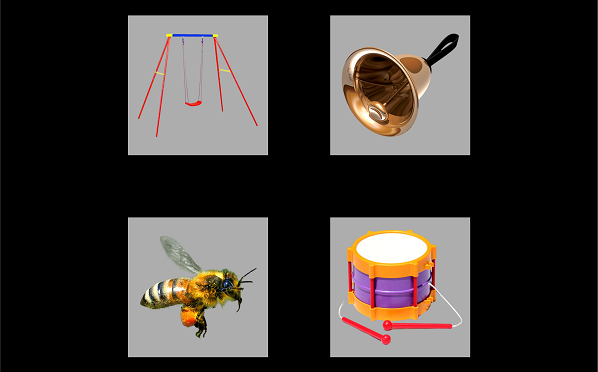

```{r setup, include = FALSE}
knitr::opts_chunk$set(comment = "#>", collapse = TRUE)
```

Consider data from a Visual World style experiment. On each trial, an array of
images appears. For example:

```{r sample-screen3, echo = FALSE, out.width = "70%"}

```

The listener hears a prompt to view one of images: _Find the bell_.

Among these images is a target (here, _bell_), a phonological competitor
(_bee_), a semantic competitor (_drum_), and an unrelated word (_swing_).

We have some eyetracking data from this experiment for one participant:

```{r}
library(littlelisteners)
library(dplyr, warn.conflicts = FALSE)
four_image_data
```

The gazes are coded in the `GazeByImageAOI` column as looks to the `"Target"`,
`"PhonologicalFoil"`, `"SemanticFoil"`, or `"Unrelated"` images, or as
`"tracked"` (ambiguous/intermediate location) or `NA` (offscreen or missing).


## Response definitions

To deal with eyetracking data in a generic way, we need a way to describe
eyetracking responses. We assume that there are four basic gaze types.

* Primary responses: A gaze to a primary or target image.
* Other responses: Gazes to competing images.
* Elsewhere looks: A gaze that is onscreen but not a primary or
  other response. Typically, this occurs when the participant is
  shifting between images.
* Missing looks: A missing or offscreen gaze.

A _response definition_ is a programmatic way of describing these response
types. In the code below, `response_def` is a response definition for the
four-image experiment with a `"Target"` image and the three competing images
lumped together in the `"Others"` `"Distractor"` and other looks are either
`"tracked"` or missing (`NA`).

```{r}
response_def <- create_response_def(
  primary = "Target",
  others = c("PhonologicalFoil", "SemanticFoil", "Unrelated"),
  elsewhere = "tracked",
  missing = NA,
  label = "looks to target"
)
response_def
```

## Aggregating looks

These response definitions allow us to aggregate looking data in a generic way.
The function `aggregate_looks()` counts the number of looks to each of the four
response categories using an aggregation formula. For example, we can count
looks by participant. There are several columns here, so we view `glimpse()` 
to look at some values from all of them.

```{r}
four_image_data %>% 
  aggregate_looks(response_def, Subject ~ GazeByImageAOI) %>% 
  glimpse()
```

Or looks by participant by trial. Here we just print the dataframe as is.

```{r}
four_image_data %>% 
  aggregate_looks(response_def, Subject + TrialNo ~ GazeByImageAOI)
```

We can also perform other kind of aggregations using different response
definitions. For instance, we can compare image locations by writing a new
response definition.

```{r}
location_def <- create_response_def(
  primary = "LowerLeftImage",
  others = c("UpperRightImage", "UpperLeftImage", "LowerRightImage"),
  elsewhere = "tracked",
  missing = NA
)

aggregate_looks(four_image_data, location_def, Subject ~ GazeByAOI) %>% 
  glimpse()
```

We can perform multiple aggreations at once. First, `cycle_response_def()` can
create a cycle of response definitions where each response acts as the primary
outcome at least once.

```{r}
all_defs <- cycle_response_def(response_def)
all_defs
```

When given a list of response definitions, `aggregate_looks()` will compute the
aggregation for each one.

```{r}
four_image_data %>% 
  aggregate_looks(all_defs, Subject ~ GazeByImageAOI) %>% 
  select(ResponseDef = .response_def, Subject, Primary, 
         Others, Prop, PropSE, PropNA) %>% 
  knitr::kable()
```

## Growth curve analysis is aggregating looks over time

With `aggregate_looks()`, we can estimate the growth curves of looking
probabilities. First, for this data-set, we need to adjust the eyetracking
timestamps so that time 0 occurs at target onset. We are also going to bin and
downsample the eyetracking data to have an effective sampling rate of 10 frames
per second.

```{r}
growth_curves <- four_image_data %>% 
  adjust_times(Time, TargetOnset, Subject, BlockNo, TrialNo) %>% 
  filter(-1005 <= Time, Time <= 2000) %>% 
  assign_bins(6, Time, Subject, BlockNo, TrialNo) %>% 
  # Set a time for each bin
  group_by(Subject, BlockNo, TrialNo, .bin) %>% 
  mutate(BinTime = round(min(Time))) %>% 
  aggregate_looks(all_defs, Subject + BinTime ~ GazeByImageAOI) %>% 
  rename(Time = BinTime)
```

We now have four growth curves, one for each image type, in a single dataframe.

```{r}
growth_curves
```

We can plot these growth curves.

```{r}
library(ggplot2)
ggplot(growth_curves) +
  aes(x = Time, y = Prop, color = .response_def) +
  geom_hline(size = 2, color = "white", yintercept = .25) +
  geom_vline(size = 2, color = "white", xintercept = 0) +
  geom_pointrange(aes(ymin = Prop - PropSE, ymax = Prop + PropSE)) +
  labs(y = "Proportion of looks",
       x = "Time relative to target onset [ms]",
       color = "Image")
```


